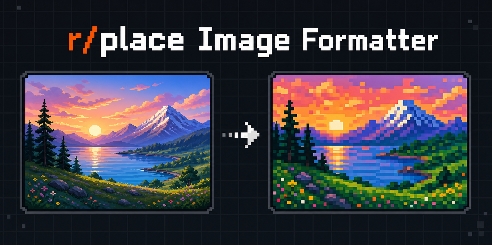
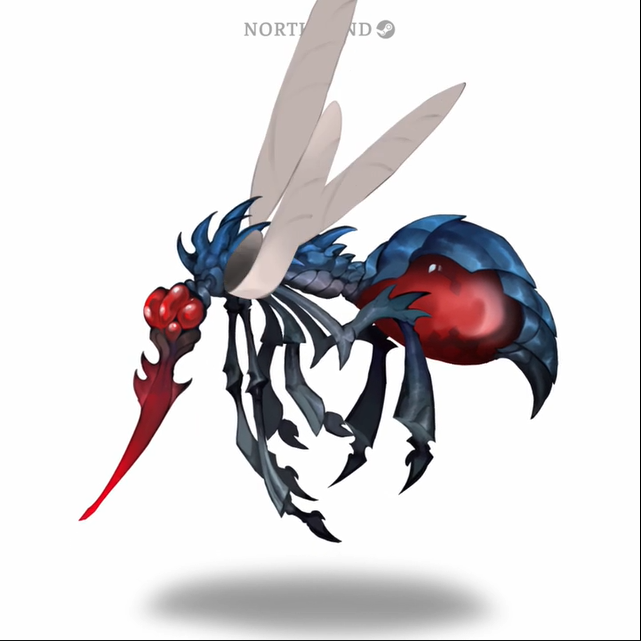

# Reddit Place Image Formatter



Convert images, animated GIFs, and videos into pixel art using the 32-color r/place palette. The importable formatter package powers both the command-line and Flask interfaces, so their output and validation rules stay consistent.

## Features

- Aspect-ratio-preserving pixelation with configurable logical width and display scale
- Deterministic LAB palette matching and preserved image transparency
- Optional pixel grid
- Static image, animated GIF, and video processing
- Hardened Flask uploads with byte, decoded-pixel, and frame limits
- Docker image, test suite, and multi-version CI

## Install

Python 3.10 or newer is required. FFmpeg must be available for video input and output.

```bash
python -m venv .venv
# Windows: .venv\Scripts\activate
# macOS/Linux: source .venv/bin/activate
python -m pip install --upgrade pip
python -m pip install ".[web]"
```

For development, install `.[web,dev]` and run `pytest`.

## CLI

```bash
place-formatter input.png 64 --output pixel_input.png
place-formatter animation.gif 48 --no-grid --scale 8
place-formatter clip.mp4 32 --output pixel_clip.mp4
```

The Python API exposes `format_image()` for Pillow images and `format_file()` for files:

```python
from formatter import FormatOptions, format_file

result = format_file("input.png", "output.png", FormatOptions(width=64))
print(result.output_path)
```

## Web

```bash
flask --app web.app run
```

Environment limits:

| Variable | Default | Purpose |
|---|---:|---|
| `MAX_UPLOAD_MB` | 16 | Maximum HTTP upload size |
| `MAX_IMAGE_PIXELS` | 20000000 | Maximum decoded pixels per frame |
| `MAX_MEDIA_FRAMES` | 300 | Maximum GIF/video frame count |

Files are validated by extension and decoded content, processed in an isolated temporary directory, and deleted after the response payload is prepared.

## Docker

```bash
docker build -t reddit-place-image-formatter .
docker run --rm -p 8000:8000 -e MAX_UPLOAD_MB=16 reddit-place-image-formatter
```

Open `http://localhost:8000`; health checks are available at `/health`.

## Supported Formats

- Images: BMP, JPEG, PNG, TIFF, WebP. Static output is PNG to preserve palette accuracy and transparency.
- Animation: GIF input and output, including per-frame processing and preserved frame timing.
- Video: AVI, MKV, MOV, MP4, and WebM input. Video output is H.264 MP4 and requires FFmpeg.

Container or operating-system codec availability can further limit which video encodings are decodable. Unsupported, malformed, oversized, or frame-heavy media is rejected with a controlled error.

## Examples

| Input | r/place output |
|---|---|
|  |  |
|  |  |

## Project Layout

```text
formatter/  shared processing API
cli/        command-line interface
web/        Flask application and templates
tests/      regression and smoke tests
examples/   side-by-side source and output media
```

## Troubleshooting

- Install FFmpeg and ensure `ffmpeg` is on `PATH` when video decoding fails outside Docker.
- Reduce width, scale, or frame count if processing is too expensive.
- JPEG cannot store transparency; static formatter output is therefore always PNG.

Licensed under GPL-3.0. Created by Recep Takak, with prior contributions from Maxime66410 and mikesingleton.
